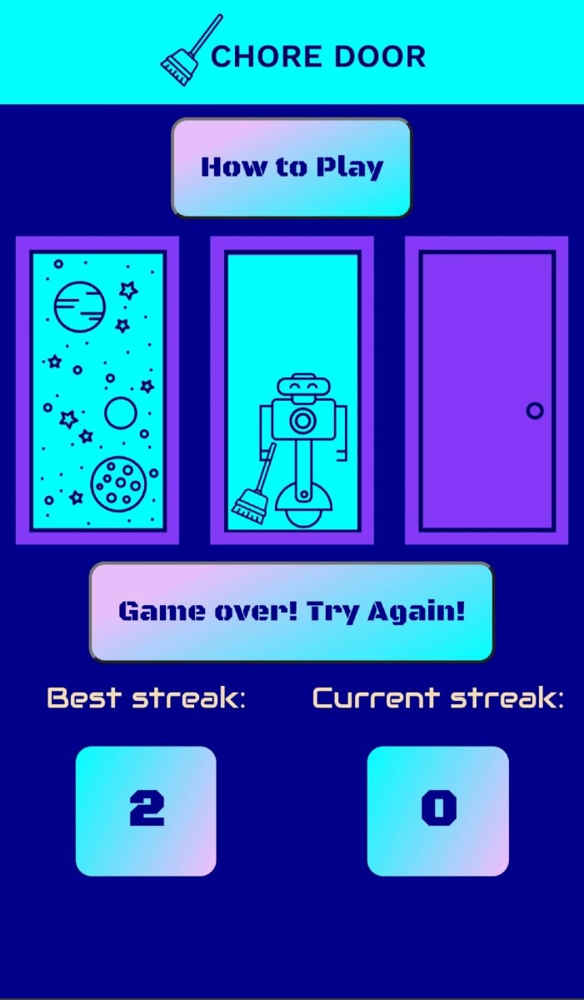
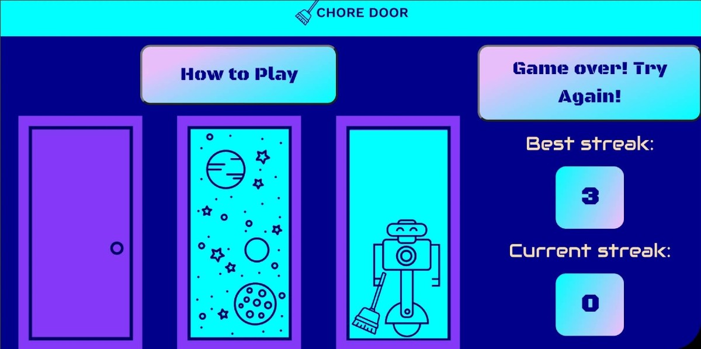

# Chore Door

Single player, button-based game

## Table of Contents

-   [Introduction](#introduction)
-   [Technologies](#technologies)
-   [Launch](#launch)
-   [Illustration](#Illustration)
-   [Sources](#sources)
-   [Contact Me](#contact)

## Introduction

The goal of this Codecademy project was to build a fully-functional game on a single-page website. The day after completing the project on Codecademy, I challenged myself to build it again without the guidance of the lesson. I played with adding some functionality, styling, and design. At some point, I did have to look into how to tie in some functions to each other.

In the project lesson there was no instruction on how to set up the score keeping despite it being part of the example finished project. That was a nice challenge to build completely from scratch.

I am grateful to have had a [friend](https://github.com/jnoreiga) challenge me to better randomize which image appears behind each door. My attempt at this was quite messy. Luckily he showed a simple way of achieving this via his contribution to the project.

## Technologies

-   JavaScript
-   CSS
-   HTML5

## Launch

[Site for the game](https://anthonychavis.github.io/chore-door/)

## Illustration

## Sources

This project is based on [Codecademy's Chore Door project](https://content.codecademy.com/projects/chore-door/chore-door-final/index.html). The project lesson is [Building Interactive JavaScript Websites: JavaScript Interactive Websites - Chore Door](https://www.codecademy.com/courses/build-interactive-websites/projects/chore-door).

## Contact

[Anthony Chavis](gitanthony@yahoo.com).
